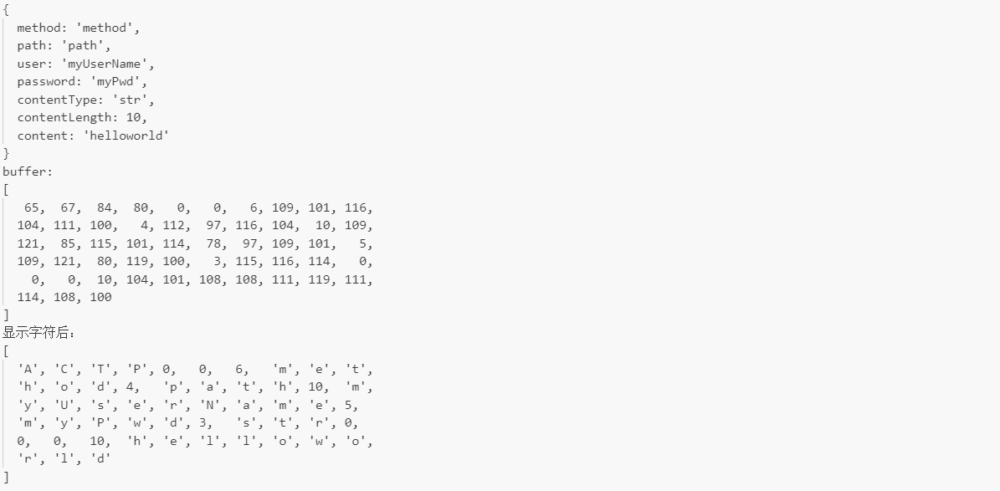
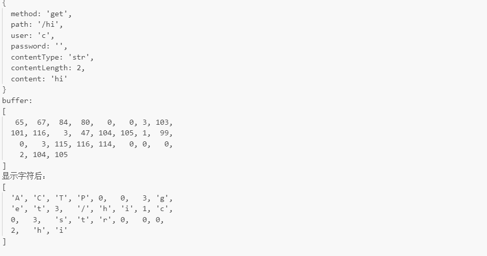
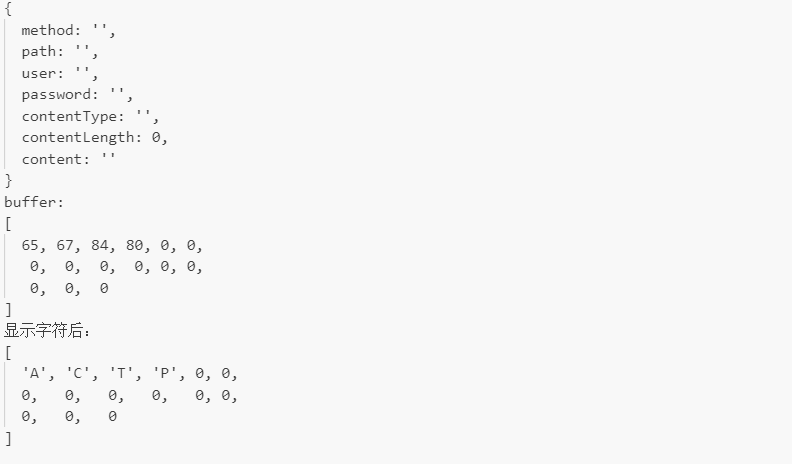
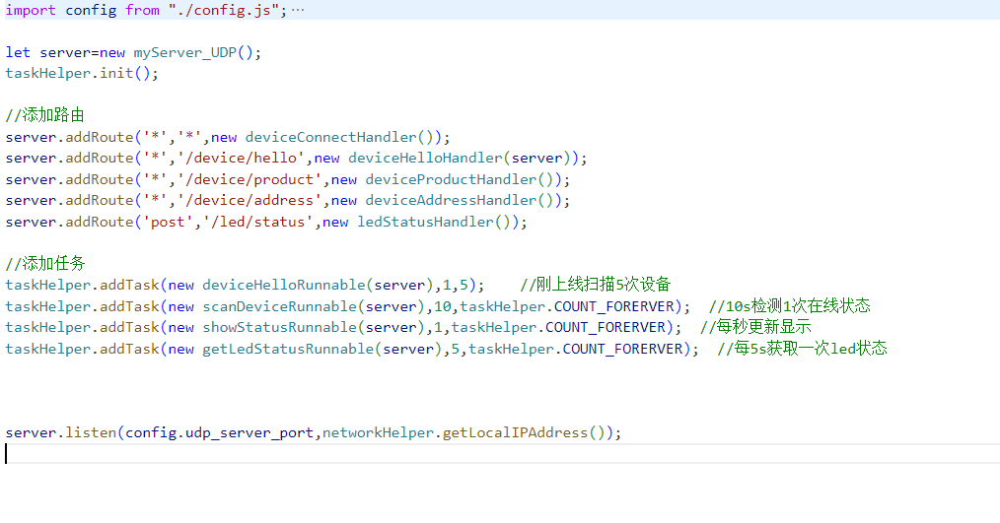
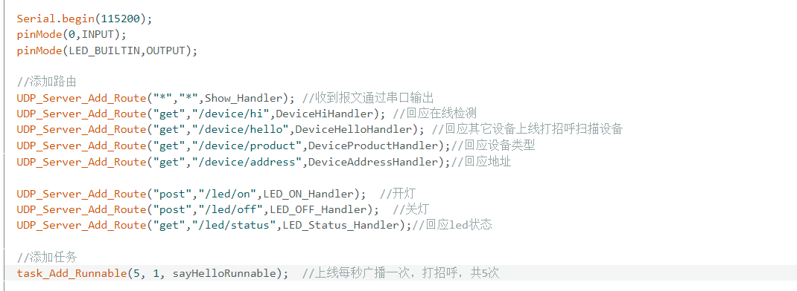
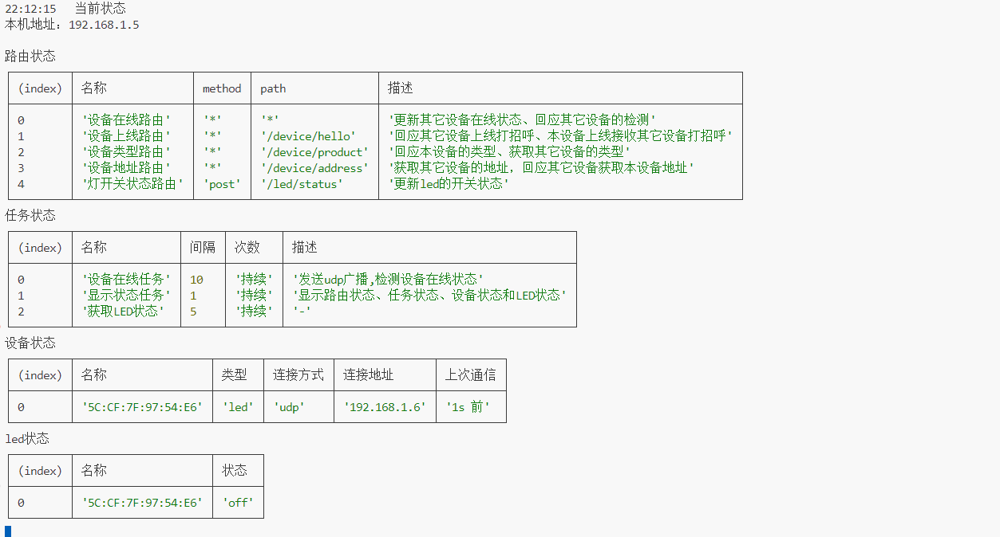

#### 项目起点

什么是服务端？什么是客户端？提供服务的是服务端，获取服务的是客户端。一个控制卧室灯开关的模块，天然就提供了"开关灯"和"查询卧室灯状态"的服务，它作为服务端是非常符合直觉的。

现在常用的MQTT协议把它们都作为客户端来处理。一来不符合直觉，二来很多Web开发的经验没有办法用在物联网开发上。HTTP协议其实也并不完全适合物联网场景。

于是仿Web开发物联网项目就开始了。:)

#### packet

仿web开发自然需要一个仿HTTP的应用层数据包。当然仿得不是越像越好，相比于HTTP报文这个数据包有这些特点：

* 数据包头不是纯字符串，而是整型数据和字符串、二进制数组混合在一起。
* 保留有method、path、content_type、content_len、content字段。
* 没有查询字符串，不管是什么方法，数据写在content字段里。
* 不区分请求头、响应头，当然也没有请求头字段、响应头字段。
* 为了更适用物联网场景，添加了user字段和password字段。
* 不固定长度的数据，比如字符串、二进制数组，**在字段前标记长度**，**用长度**而非转义字符**来划分字段**。

| 字段 | 固定 | 字节数 | 类型 | 内容 |
| ----| ---- | ---- | ---- | ----|
| - | 是 | 4 | str | 协议名，区分其它数据包 |
| ver | 是 | 2 | uint |  协议版本号 |
| method_len | 是 | 1| uint | 方法字段的长度|
| **method**     | 否 | -| str | 方法字段|
| path_len | 是 | 1| uint | 路径字段的长度|
| **path** | 否 | -| str | 路径字段|
| user_len | 是 | 1| uint | 用户字段的长度|
| **user**     | 否 | -| buffer | 用户字段|
| password_len | 是 | 1| uint | 密码字段的长度|
| **password** | 否 | -| buffer | 密码字段|
| content_type_len | 是 | 1| uint | 内容类型字段的长度|
| **content_type**     | 否 | -| str | 内容类型字段|
| **content_len** | 是 |4| uint | 内容字段的长度|
| **content** | 否 | -| buffer | 内容字段|

看着字段有点多，其实核心部分就是**method**，**path**，**user**，**password**，**content_type**和**content**字段，这些字段**按顺序出现**，在它们的前方**标记长度**。

**以下是几个数据包示例**

#### 传输过程

* 每个UDP包放一个数据包。

* 没有请求数据包和响应数据包的区分，把数据包发给对方后，**对方可以回应，也可以不回应**。

* 回应就是自己生成一个数据包，以相同方式发给对方**。

#### 处理器函数和路由

处理器handler就是对请求的处理过程的函数，有3个参数 req , res 和 flag。

| 参数 | 类型 | 作用 | 
| ----| ---- | ---- | 
| req  | 数据包 | 访问客户端请求的内容 | 
| res | 数据包 | 构建回应的数据包 | 
| flag | 对象/结构体 | 获取数据包来源、控制请求处理过程 |

>   /**
     * 
     * @param {myPacket} req 请求
     * @param {myPacket} res 响应
     * @param {{next:boolean,send:boolean,comm_type:string}} flag 
     */
    handler(req,res,flag){
    }

**修改flag的next和send属性能控制处理过程。**

* 默认next为false，不交给下一个处理器处理，修改为true则寻找下一个匹配的处理器。也就是**不区分路由和中间件**。

* 默认send为false，当全部处理完后不回应对方。修改为true则在最后回应，即按相同方式发送一个新数据包给对方。

路由指根据接收到的数据包的 方法字段(method) 和 路径字段(path) 来决定是否处理器函数处理。添加路由就是指定某个方法和路径下，交给哪个处理函数处理。

添加路由示例：

> //当req的method为get，path为/hello时匹配成功，执行回调函数
> server.addRouteHandler('get','/hello',(req,res,flag)=>{
>
> });

> //当req的method为get，path为/device/hi时匹配成功，执行DeviceHiHandler函数
> UDP_Server_Add_Route("get","/device/hi",DeviceHiHandler);

#### 最后放几张截图
****

可以看到虽然语言不太一样，但代码思路很像了

****

正常工作
